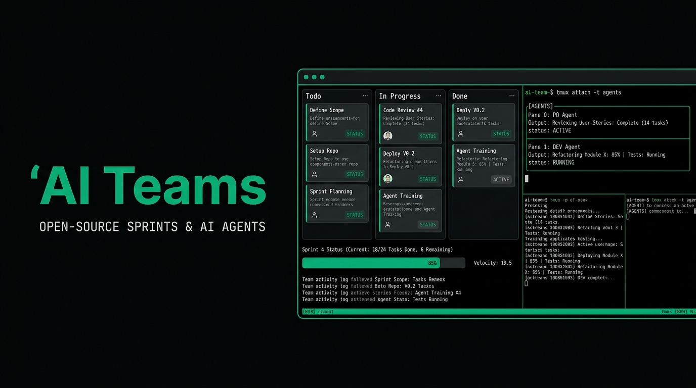

# AI Teams



A Kanban board for managing **tmux-based AI agent teams**. Assignees are tmux pane roles (PO, DEV, BE, FE, QA, TL) — not humans. AI agents (Claude Code instances) read and edit Markdown board files directly.

---

## Features

- **Kanban board** — todo → in_progress → in_review → testing → done
- **Sprint management** — create, start, complete; incomplete items auto-return to backlog
- **File Manager** — browse, upload (drag & drop + folder), create, rename, delete, edit, preview
- **Terminal** — embedded tmux terminal per project
- **Markdown board** — agents manage the board by editing Markdown files in `docs/board/`
- **notify_boss** — agents notify the human operator via MCP tool

---

## Quick Setup

```bash
git clone git@github.com:VinhHung1999/ai-teams.git
cd ai-teams
chmod +x setup.sh
./setup.sh
```

The script handles everything: prerequisites check, `.env` prompts (Google OAuth), install, build, PM2 start.

---

## Prerequisites

| Requirement | Version | Install |
|-------------|---------|---------|
| Node.js | ≥ 18 | https://nodejs.org |
| PM2 | any | `npm install -g pm2` |

---

## Manual Setup

### 1. Frontend environment

Create `frontend/.env.local`:
```env
GOOGLE_CLIENT_ID=your-client-id
GOOGLE_CLIENT_SECRET=your-client-secret
AUTH_SECRET=<random-32-byte-hex>
NEXTAUTH_URL=http://localhost:3340
ALLOWED_EMAILS=you@gmail.com,teammate@gmail.com
```

Generate `AUTH_SECRET`: `node -e "console.log(require('crypto').randomBytes(32).toString('hex'))"`

### 2. Install, build & start

```bash
cd backend-node && npm install && npm run build && cd ..
cd frontend && npm install && cd ..
pm2 start ecosystem.config.js && pm2 save
```

---

## Google OAuth

1. [Google Cloud Console → Credentials](https://console.cloud.google.com/apis/credentials) → Create OAuth 2.0 Client ID
2. Authorized redirect URI: `http://localhost:3340/api/auth/callback/google`
3. Copy credentials to `frontend/.env.local`
4. Add allowed Gmail addresses to `ALLOWED_EMAILS`

---

## Ports

| Service | Port |
|---------|------|
| Frontend (Next.js) | 3340 |
| Backend API (Express) | 17070 |

Frontend proxies `/api/*` and `/ws/*` to the backend — no separate backend tunnel needed.

---

## notify_boss MCP Tool

Agents can notify the human operator via `notify_boss`. Configure in `~/.claude/settings.json`:

```json
{
  "mcpServers": {
    "ai-teams": {
      "command": "...",
      "args": ["..."]
    }
  }
}
```

---

## tmux AI Team

Spin up a 2-agent Scrum team (PO + DEV) with the included skill:

```bash
# See skills/tmux-team-creator-md/ for full docs
```

Agents communicate via `tm-send` and manage the board by editing Markdown files directly.

---

## Project Structure

```
ai-teams/
├── backend-node/     # Express + TypeScript API
├── frontend/         # Next.js 15 + React 19
├── skills/           # tmux-team-creator-md
├── docs/             # Workflow docs + board files
├── ecosystem.config.js
└── setup.sh
```

---

## License

MIT
